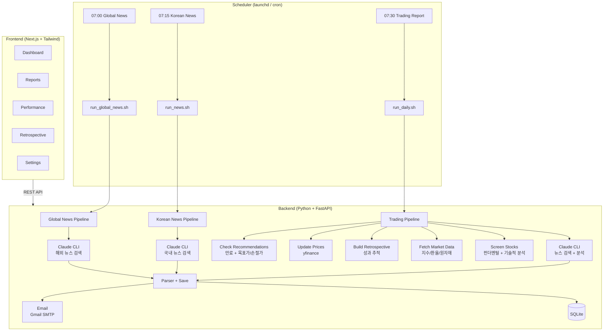

<div align="center">

# Daily News Report

**AI-powered daily news briefing & trading report system with self-improving retrospective**

[](https://opensource.org/licenses/Apache-2.0)
[](https://www.python.org)
[](https://nextjs.org)
[](https://fastapi.tiangolo.com)
[](https://claude.ai)

바쁜 아침, 뉴스와 시장을 직접 확인할 시간이 부족하신가요?<br/>
매일 아침 AI가 **국내 뉴스**, **해외 뉴스**, **트레이딩 리포트** 세 가지 파이프라인을 자동으로 실행하여<br/>
실시간 웹 검색 기반 뉴스 브리핑과 시장 분석 리포트를 이메일로 보내드립니다.<br/>
과거 추천 성과를 추적하며 **스스로 학습하고 개선**하는 시스템입니다.

[주요 기능](#주요-기능) · [빠른 시작](#빠른-시작) · [대시보드](#대시보드) · [아키텍처](#아키텍처) · [기여하기](#기여하기)

<br/>


</div>

---

<a id="주요-기능"></a>

## 🚀 주요 기능

### 📋 트리플 파이프라인

| 파이프라인 | 스케줄 | 설명 |
|----------|----------|-------------|
| **해외 뉴스 브리핑** | 07:00 KST | 세계 정치, 글로벌 경제, 기술, 과학, 기후, 분쟁, 문화 등 7개 카테고리 해외 뉴스 |
| **국내 뉴스 브리핑** | 07:15 KST | 정치, 경제, 사회, 기술, 문화, 국제, 오늘의 일정 등 7개 카테고리 국내 뉴스 |
| **트레이딩 리포트** | 07:30 KST | 뉴스 기반 인과관계 분석 + 한국/미국 시장 트레이딩 추천 |

### ✨ 핵심 기능

- **AI 뉴스 분석** — Claude Code CLI가 20+ 웹 검색으로 국내외 뉴스를 심층 분석
- **트레이딩 리포트** — 인과관계 분석 (뉴스 → 직접 영향 → 파생 효과 → 투자 기회)
- **듀얼 마켓** — 한국 (KOSPI/KOSDAQ) + 미국 (NYSE/NASDAQ) 주식 추천
- **실시간 시세** — yfinance로 주요 지수/환율/원자재를 사전 수집
- **자기 개선 회고** — 과거 추천 성과를 추적하고, 성공/실패 패턴을 다음 추천에 반영
- **프로페셔널 이메일** — 다크 모드, 카드 기반, Gmail 호환 HTML 리포트
- **웹 대시보드** — 성과 차트, 추천 이력, 주간 회고를 시각적으로 확인
- **통합 스케줄러** — macOS (launchd) + Linux/WSL2 (cron), `make dev`로 한번에 실행
- **다국어 지원** — 한국어, 영어, 일본어 (`REPORT_LANGUAGE`)

<details>
<summary><b>🌏 Features (English)</b></summary>

- **AI News Analysis** — Claude Code CLI performs 20+ web searches for in-depth news analysis
- **Triple Pipeline** — Global news (07:00) → Korean news (07:15) → Trading report (07:30)
- **Causal Chain Analysis** — News → Direct Impact → Derived Effects → Investment Opportunities
- **Dual Market Coverage** — Korean (KOSPI/KOSDAQ) + US (NYSE/NASDAQ)
- **Real-Time Market Data** — Pre-fetches indices, FX rates, and commodities via yfinance
- **Self-Improving Retrospective** — Tracks outcomes, analyzes patterns, feeds learnings into future reports
- **Professional HTML Email** — Dark mode, card-based, Gmail-compatible
- **Web Dashboard** — Performance charts, recommendation history, weekly retrospective
- **Integrated Scheduler** — macOS (launchd) + Linux/WSL2 (cron)
- **Multi-Language** — Korean, English, Japanese reports

</details>

<a id="빠른-시작"></a>

## ⚡ 빠른 시작

### 📌 사전 요구사항

- Python 3.11+
- [uv](https://docs.astral.sh/uv/) (Python 패키지 매니저)
- Node.js 20+ & [Yarn Berry](https://yarnpkg.com/) (v4+)
- [Claude Code CLI](https://claude.ai/code)
- Gmail 계정 + [앱 비밀번호](https://myaccount.google.com/apppasswords)

### 1. 클론 & 설정

```bash
git clone https://github.com/baba9811/daily-news-report.git
cd daily-news-report

cp .env.example .env
```

`.env` 파일을 열고 인증 정보를 입력하세요:

```bash
SMTP_USER=your-email@gmail.com
SMTP_PASSWORD=your-app-password        # Gmail 앱 비밀번호 (16자리)
EMAIL_FROM=your-email@gmail.com
EMAIL_TO=["recipient@email.com"]
```

### 2. 설치

```bash
make setup
```

Python 의존성(`uv sync`), 프론트엔드 의존성(`yarn install`), 데이터베이스 초기화를 모두 수행합니다.

### 3. 실행

```bash
# 전체 실행 (백엔드 + 프론트엔드 + 3개 스케줄러)
make dev
# 백엔드:  http://localhost:8000
# 프론트엔드: http://localhost:3000
# Ctrl+C로 전체 종료

# 파이프라인 1회 수동 실행
make run              # 트레이딩 리포트
make run-news         # 한국 뉴스 브리핑
make run-global-news  # 해외 뉴스 브리핑
```

### 4. 스케줄러 관리

<table>
<tr><th></th><th>macOS (launchd)</th><th>Linux / WSL2 (cron)</th></tr>
<tr><td><b>Trading Report</b></td><td>

```bash
make scheduler-install
make scheduler-status
make scheduler-start
make scheduler-stop
make scheduler-uninstall
```

</td><td>

```bash
make scheduler-linux-install
make scheduler-linux-status
make scheduler-linux-start
make scheduler-linux-stop
make scheduler-linux-uninstall
```

</td></tr>
<tr><td><b>Korean News</b></td><td>

```bash
make news-scheduler-install
make news-scheduler-status
make news-scheduler-start
```

</td><td>

```bash
make news-scheduler-linux-install
make news-scheduler-linux-status
make news-scheduler-linux-start
```

</td></tr>
<tr><td><b>Global News</b></td><td>

```bash
make global-news-scheduler-install
make global-news-scheduler-status
make global-news-scheduler-start
```

</td><td>

```bash
make global-news-scheduler-linux-install
make global-news-scheduler-linux-status
make global-news-scheduler-linux-start
```

</td></tr>
</table>

스케줄 시간을 변경하려면 `.env`에서 수정한 뒤 install 명령을 다시 실행하세요:

| 변수 | 기본값 | 설명 |
|------|--------|------|
| `SCHEDULE_TIME` | `07:30` | 트레이딩 리포트 (KST) |
| `NEWS_SCHEDULE_TIME` | `07:15` | 한국 뉴스 브리핑 (KST) |
| `GLOBAL_NEWS_SCHEDULE_TIME` | `07:00` | 해외 뉴스 브리핑 (KST) |

<a id="대시보드"></a>

## 📊 대시보드

`http://localhost:3000` 에서 웹 대시보드를 확인할 수 있습니다:

| 페이지 | 설명 |
|--------|------|
| **Dashboard** | 오늘의 리포트 요약, 활성 추천, 주요 지표 |
| **Reports** | 일일/주간/뉴스 리포트 열람 (검색 + 페이지네이션) |
| **Performance** | 승률, P&L 타임시리즈 차트, 섹터별 성과 분석 |
| **Retrospective** | 주간 종합 회고, 전략 조정 제안 |
| **Settings** | 이메일, Claude 모델, 언어 설정, 시스템 상태 확인 |

<a id="아키텍처"></a>

## 🏗️ 아키텍처



**백엔드**는 [헥사고날 아키텍처](https://alistair.cockburn.us/hexagonal-architecture/) (Ports & Adapters)를 따릅니다:

```
backend/src/daily_scheduler/
├── domain/           # 엔티티, 포트(인터페이스) — 순수 비즈니스 로직
├── application/      # 유스케이스 (파이프라인, 회고, 시장 데이터)
├── infrastructure/   # 어댑터 (yfinance, Claude CLI, SMTP, SQLAlchemy)
├── entrypoints/      # API 라우트 (FastAPI), CLI 커맨드 (Typer)
├── templates/        # Jinja2 프롬프트 템플릿
└── constants.py      # 튜닝 가능한 상수 (타임아웃, 만료 기간 등)
```

## 🔄 회고 시스템

자기 개선 피드백 루프는 매일 실행됩니다:

```
1. 모든 활성 추천의 현재가를 조회
2. 목표가/손절가 도달 여부 자동 체크 → 손익(P&L) 계산
3. 30일 통계 생성: 승률, 섹터별 성과, 전략별(DAY/SWING) 비교
4. 실시간 시세 수집 (지수, 환율, 원자재)
5. 모든 컨텍스트를 Claude 프롬프트에 주입
6. Claude가 뉴스 검색 → 인과관계 분석 → 파생효과 분석 → 추천 생성
7. 새 추천 → 다음날 성과 추적 → 피드백 루프 반복
```

**주간 회고 (매주 월요일)**:
- 전주 전체 추천 성과 종합 분석
- 섹터별/전략별 승률 비교
- 전략 조정 제안 및 교훈 도출

## 📁 프로젝트 구조

```
daily-news-report/
├── backend/                 # Python 백엔드 (FastAPI + 헥사고날 아키텍처)
│   ├── src/daily_scheduler/
│   │   ├── domain/          # 엔티티, 포트 (인터페이스)
│   │   ├── application/     # 유스케이스 (파이프라인, 회고, 시장 데이터)
│   │   ├── infrastructure/  # 어댑터 (yfinance, Claude CLI, SMTP, SQLAlchemy)
│   │   ├── entrypoints/     # API 라우트, CLI 커맨드
│   │   ├── templates/       # Jinja2 프롬프트 템플릿 (korean_news, global_news, daily_report)
│   │   └── constants.py     # 튜닝 가능한 상수
│   ├── tests/               # pytest 단위 + 통합 테스트
│   ├── alembic/             # 데이터베이스 마이그레이션
│   └── pyproject.toml       # uv 프로젝트 설정
├── frontend/                # Next.js 15 (App Router + Tailwind CSS + Recharts)
│   └── src/app/             # 페이지: 대시보드, 리포트, 성과, 회고, 설정
├── scheduler/               # 스케줄러 설정
│   ├── install.sh           # macOS launchd (Trading Report)
│   ├── install-news.sh      # macOS launchd (Korean News)
│   ├── install-global-news.sh  # macOS launchd (Global News)
│   ├── install-*-linux.sh   # Linux/WSL2 cron 버전
│   └── run_*.sh             # 파이프라인 실행 래퍼
├── .env.example             # 환경 변수 템플릿 (커밋됨, 안전)
├── Makefile                 # 50+ 편의 명령어
├── SPEC.md                  # 76개 검증 가능한 동작 사양
└── DISCLAIMER.md            # 금융 데이터 & AI 면책 조항
```

## ⚙️ 설정

### 환경 변수 (`.env`) — 시크릿 & 환경별 설정

| 변수 | 설명 | 기본값 |
|------|------|--------|
| `SMTP_HOST` | SMTP 서버 호스트 | `smtp.gmail.com` |
| `SMTP_PORT` | SMTP 포트 | `587` |
| `SMTP_USER` | Gmail 주소 | — |
| `SMTP_PASSWORD` | Gmail 앱 비밀번호 | — |
| `EMAIL_TO` | 수신자 (JSON 배열) | — |
| `CLAUDE_CLI_PATH` | Claude CLI 바이너리 경로 | `claude` |
| `CLAUDE_MODEL` | Claude 모델 (opus / sonnet / haiku) | `opus` |
| `REPORT_LANGUAGE` | 리포트 언어 (`ko`, `en`, `ja`) | `ko` |
| `TIMEZONE` | IANA 타임존 | `Asia/Seoul` |
| `SCHEDULE_TIME` | 트레이딩 리포트 시간 KST (HH:MM) | `07:30` |
| `NEWS_SCHEDULE_TIME` | 한국 뉴스 브리핑 시간 KST (HH:MM) | `07:15` |
| `GLOBAL_NEWS_SCHEDULE_TIME` | 해외 뉴스 브리핑 시간 KST (HH:MM) | `07:00` |
| `DATABASE_URL` | SQLite 데이터베이스 경로 | `sqlite:///data/daily_scheduler.db` |

### 애플리케이션 상수 (`constants.py`) — 튜닝 가능한 기본값

| 상수 | 설명 | 기본값 |
|------|------|--------|
| `CLAUDE_TIMEOUT_SECONDS` | Claude CLI 호출 타임아웃 | `1200` |
| `CLAUDE_RETRY_COUNT` | 실패 시 재시도 횟수 | `2` |
| `DAY_TRADE_EXPIRY_DAYS` | DAY 트레이드 자동 만료 | `1` |
| `SWING_TRADE_EXPIRY_DAYS` | SWING 트레이드 자동 만료 | `14` |
| `RETROSPECTIVE_LOOKBACK_DAYS` | 회고 분석 기간 | `30` |

## 🛠️ 기술 스택

| 레이어 | 기술 |
|--------|------|
| **백엔드** | Python 3.11+, FastAPI, SQLAlchemy, SQLite, Alembic, Pydantic, Jinja2, aiosmtplib |
| **프론트엔드** | Next.js 15, React 19, TypeScript 5.7, Tailwind CSS 4, Recharts, TanStack Query |
| **AI** | Claude Code CLI (Anthropic) |
| **시장 데이터** | yfinance (Yahoo Finance) |
| **스케줄러** | macOS launchd, Linux cron |
| **패키지 매니저** | uv (Python), Yarn Berry v4 (Frontend) |
| **코드 품질** | ruff, pylint, pyrefly, mypy, ESLint, oxlint, pytest, Playwright |

## ⚠️ 면책 조항

> **이 소프트웨어는 교육 및 연구 목적으로만 제공됩니다.**
> AI가 생성한 트레이딩 추천은 투자 조언이 아니며, 금융 손실에 대한 책임은 사용자에게 있습니다.
> 자세한 내용은 [DISCLAIMER.md](DISCLAIMER.md)를 참조하세요.

금융 데이터는 [yfinance](https://github.com/ranaroussi/yfinance)를 통해 수집됩니다. [Yahoo Finance 이용약관](https://legal.yahoo.com/us/en/yahoo/terms/product-atos/apitnc/index.html)을 준수해야 합니다.

<a id="기여하기"></a>

## 🤝 기여하기

이 프로젝트에 관심을 가져주셔서 감사합니다!
버그 리포트, 기능 제안, 코드 기여 등 어떤 형태의 참여든 큰 도움이 됩니다.
개발 환경 설정 및 가이드라인은 [CONTRIBUTING.md](CONTRIBUTING.md)를 참조해 주세요.

## 🔒 보안

보안 취약점을 발견하셨다면 [SECURITY.md](SECURITY.md)를 참조하세요.

## 📄 라이선스

이 프로젝트는 [Apache License 2.0](LICENSE) 하에 배포됩니다.

---

<div align="center">
  <sub>이 프로젝트가 도움이 되셨다면 ⭐️ Star를 눌러주세요!</sub><br/>
  <sub>Built with Claude Code · FastAPI · Next.js · yfinance</sub>
</div>

<!--
  GitHub Topics (Settings → Topics):
  ai, trading, stock-market, daily-report, news-briefing, claude, fastapi, nextjs,
  python, typescript, kospi, nasdaq, retrospective, email-automation,
  hexagonal-architecture, yfinance, global-news
-->
