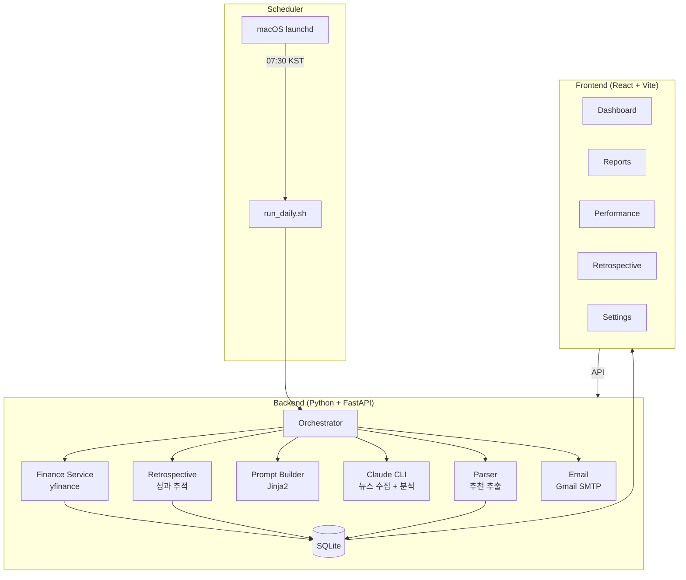

<div align="center">

# 📈 Daily Scheduler

**AI-powered daily news & trading report system with self-improving retrospective**

[](https://opensource.org/licenses/Apache-2.0)
[](https://www.python.org)
[](https://react.dev)
[](https://fastapi.tiangolo.com)
[](https://claude.ai)

매일 아침 AI가 전 세계 뉴스를 분석하고,<br/>
한국 + 미국 시장의 트레이딩 추천 리포트를 생성하여 이메일로 발송합니다.<br/>
과거 추천 성과를 추적하며 **스스로 학습하고 개선**하는 시스템입니다.

[Quick Start](#-quick-start) · [Features](#-features) · [Architecture](#-architecture) · [Dashboard](#-dashboard) · [Contributing](#contributing)

</div>

---

## ✨ Features

- **🤖 AI 리포트 생성** — Claude Code CLI가 실시간 뉴스를 검색하고, 전문 애널리스트 수준의 트레이딩 리포트를 생성
- **📊 듀얼 마켓** — 한국 (KOSPI/KOSDAQ) + 미국 (NYSE/NASDAQ) 주식 추천
- **📧 자동 이메일** — 매일 오전 7:30 KST에 프로페셔널 HTML 리포트를 이메일로 발송
- **🔄 자기 개선 회고** — 과거 추천 성과를 추적하고, 성공/실패 패턴을 분석하여 다음 추천에 반영
- **📈 웹 대시보드** — 성과 차트, 추천 이력, 주간 회고를 시각적으로 확인
- **⏰ macOS 스케줄러** — `launchd`로 매일 자동 실행, 수면 중에도 놓치지 않음
- **🔒 시크릿 안전 관리** — API 키, 비밀번호는 `.env`에만 저장, 절대 커밋되지 않음

## 🏗 Architecture



## 🚀 Quick Start

### Prerequisites

- Python 3.11+
- [uv](https://docs.astral.sh/uv/) (Python package manager)
- Node.js 20+ & [Yarn Berry](https://yarnpkg.com/)
- [Claude Code CLI](https://claude.ai/code)
- Gmail account with [App Password](https://myaccount.google.com/apppasswords)

### 1. Clone & Configure

```bash
git clone https://github.com/your-username/daily-scheduler.git
cd daily-scheduler

# Copy environment template and fill in your credentials
cp .env.example .env
```

Edit `.env` with your settings:

```bash
SMTP_USER=your-email@gmail.com
SMTP_PASSWORD=your-app-password
EMAIL_FROM=your-email@gmail.com
EMAIL_TO=["recipient@email.com"]
```

### 2. Setup

```bash
make setup
```

This will:
- Install Python dependencies (`uv sync`)
- Install frontend dependencies (`yarn install`)
- Initialize the database
- Build the frontend

### 3. Run

```bash
# Run the report pipeline manually
make run

# Or start the web dashboard
make dev
# Open http://localhost:5173
```

### 4. Install Scheduler (Optional)

```bash
make install-scheduler
```

The scheduler will automatically run the pipeline every day at 7:30 AM KST.

## 📊 Dashboard

The web dashboard provides:

| Page | Description |
|------|-------------|
| **Dashboard** | 오늘의 리포트 요약, 활성 추천, 주요 지표 |
| **Reports** | 과거 일일/주간 리포트 열람 |
| **Performance** | 승률, P&L 차트, 섹터별 성과 분석 |
| **Retrospective** | 주간 종합 회고, 전략 조정 제안 |
| **Settings** | 이메일, Claude, 스케줄러 설정 관리 |

## 📁 Project Structure

```
daily-scheduler/
├── backend/                 # Python backend (FastAPI + services)
│   ├── src/daily_scheduler/
│   │   ├── services/        # Business logic (finance, claude, email, etc.)
│   │   ├── routers/         # API endpoints
│   │   ├── models/          # SQLAlchemy ORM models
│   │   ├── schemas/         # Pydantic schemas
│   │   └── templates/       # Jinja2 prompt templates
│   └── pyproject.toml       # uv project config
├── frontend/                # React SPA (Vite + Tailwind + Recharts)
│   └── src/
│       ├── pages/           # Dashboard, Reports, Performance, etc.
│       └── components/      # Reusable UI components
├── scheduler/               # macOS launchd configuration
├── .env.example             # Environment template (committed)
├── Makefile                 # Convenience commands
└── DISCLAIMER.md            # Financial data disclaimer
```

## 🔄 How the Retrospective Works

The self-improvement loop:

```
1. 매일 아침: 과거 추천 종목의 현재가를 조회
2. 목표가/손절가 도달 여부 자동 체크
3. 30일 승률, 섹터별 성과, 전략별 비교 통계 생성
4. 이 데이터를 Claude 프롬프트에 주입
5. Claude가 과거 실적을 참고하여 추천 전략 조정
6. 새 추천 → 다음날 성과 추적 → 피드백 루프 반복
```

**주간 회고 (매주 월요일)**:
- 전주 전체 추천 성과 종합 분석
- 섹터별/전략별 승률 비교
- 전략 조정 제안 및 교훈 도출

## ⚙️ Configuration

All configuration is managed through `.env`:

| Variable | Description | Default |
|----------|-------------|---------|
| `SMTP_HOST` | SMTP server hostname | `smtp.gmail.com` |
| `SMTP_PORT` | SMTP port | `587` |
| `SMTP_USER` | Gmail address | — |
| `SMTP_PASSWORD` | Gmail app password | — |
| `EMAIL_TO` | Recipient(s) as JSON array | — |
| `CLAUDE_CLI_PATH` | Path to claude binary | `claude` |
| `CLAUDE_MODEL` | Claude model to use | `sonnet` |
| `DATABASE_URL` | SQLite database path | `sqlite:///data/daily_scheduler.db` |

## 🛡 Disclaimer

> **이 소프트웨어는 교육 및 연구 목적으로만 제공됩니다.**
> AI가 생성한 트레이딩 추천은 투자 조언이 아니며, 금융 손실에 대한 책임은 사용자에게 있습니다.
> 자세한 내용은 [DISCLAIMER.md](DISCLAIMER.md)를 참조하세요.

Financial data is sourced via [yfinance](https://github.com/ranaroussi/yfinance). Users must comply with [Yahoo Finance Terms of Service](https://legal.yahoo.com/us/en/yahoo/terms/product-atos/apitnc/index.html).

## Contributing

Contributions are welcome! See [CONTRIBUTING.md](CONTRIBUTING.md) for guidelines.

## License

This project is licensed under the [Apache License 2.0](LICENSE).

---

<div align="center">
  <sub>Built with Claude Code · FastAPI · React · yfinance</sub>
</div>
